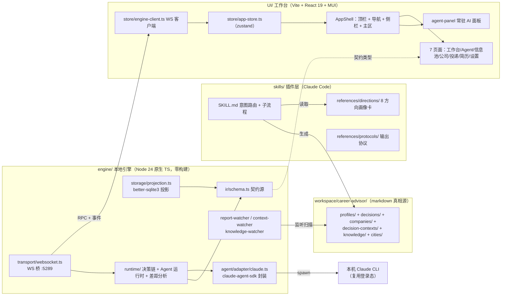

# Career OS 架构与现状总览

> 2026-08-03 | 反映当前实现状态（引擎 V2 完成 + Agent 通道落地 + 思考过程），非愿景

## 0. 一句话概括

Career OS 是一个**个人职业决策分析系统**，三件套：`skills/`（Claude Code 插件：知识与分析协议源）+ `engine/`（本地 Node 引擎：markdown 真相源 → SQLite 投影 → WebSocket RPC/事件）+ `UI/`（React 工作台：7 页可视化 + 常驻 AI 面板）。



## 1. 三层职责

| 层 | 目录 | 职责 | 关键点 |
|----|------|------|--------|
| 技能层 | `skills/career-advisor/` | 分析协议与知识源：意图路由、7 子流程、8 方向画像卡、14 字段摘要协议 | Claude Code 插件，`--plugin-dir .` 加载；产出 markdown 真相源 |
| 引擎层 | `engine/` | markdown 真相源 → IR 契约 → SQLite 投影 → WS RPC/事件；Agent 对话通道 | Node 24 原生 TS（type-stripping，零构建、仅 erasable syntax）；**零依赖外部服务**（除 better-sqlite3/chokidar/ws/SDK） |
| 前端层 | `UI/` | 工作台可视化 + AI 对话 | React 19 + Vite 5 + MUI + zustand 5；浅色瑞士风默认 |

## 2. 引擎架构

**单向依赖**（自上而下）：`transport/ runtime/ agent/ → storage/ → ir/` + `config.ts logger.ts`

```
engine/
├── main.ts                 启动编排：config → workspace → logger → 投影 → WS 桥 → watcher
├── config.ts               CLI > env > config.json > 默认；fail fast（ConfigError）
├── logger.ts               应用日志（logs/engine.log，10MB×3 轮转）+ traces（logs/traces/）
├── ir/schema.ts            ★ 契约源：8 实体 + Validation + AgentError/AgentQuestion + ProtocolVersion（引擎单方维护）
├── ir/validator.ts         合法化 + 降级（必填缺失→invalid；值域非法→degraded）
├── storage/                markdown 真相源唯一出口
│   ├── workspace.ts        目录树 + metadata/protocol.json
│   ├── report-watcher.ts   decisions/*.md → IR（扫描 + chokidar 监听）
│   ├── context-watcher.ts  decision-contexts/{问题}.md 解析 + 监听
│   ├── knowledge-watcher.ts knowledge/skills.md + roles.md 词表（别名归一化）
│   ├── projection.ts       better-sqlite3 5 张投影表
│   └── graph-builder.ts    图谱派生（pool/graph）
├── runtime/
│   ├── decision-runtime.ts 决策链状态机（6 阶段，computeChain 纯投影）
│   ├── decision-aggregate.ts 聚合视图（contexts/list，只聚合不评分）
│   ├── gap-calculator.ts   差距分析（满足≥3/可迁移 1-2/缺失，不打分）
│   └── agent-runtime.ts    Agent 任务注册表 + 权限挂起表（requestId 往返）+ cancel
├── agent/adapter/claude.ts claude-agent-sdk 封装：事件归一化 + 权限握手 + resume + 回答通道 + 思考事件
└── transport/
    ├── protocol.ts         ★ RPC 方法清单 + 事件清单（见下）
    └── websocket.ts        WS 桥 :5289（RPC + 事件广播 + 优雅关闭）
```

**WS 协议**（`transport/protocol.ts`，14 个 RPC + 4 类事件）：

| RPC | 方法 | 说明 |
|-----|------|------|
| `system/init` | 握手 | 协议/版本/工作区路径 |
| `decisions/list` `decisions/rescan` `decisions/chain` | 决策 | 全量 IR（含 validation）→ 重扫 → 决策链投影 |
| `contexts/list` | 聚合 | 决策上下文按需组装 |
| `knowledge/graph` `knowledge/gap` | 知识层 | 技能/岗位图谱 + 差距分析 |
| `companies/list` `persons/list` `pool/graph` | 视图数据 | 公司/人/信息池图谱 |
| `agent/start` `agent/answer` `agent/cancel` `agent/permission` | Agent | 任务启停 + 提问回答 + 权限决策回传 |

事件：`data.decisions.changed` / `data.pool.changed`（变更信号，客户端重拉快照）、`error.engine`、`agent.event`（Agent 流式事件，见 §4）。

## 3. 前端架构

**单向依赖**：`pages/ components/ → store/ → data/ → types/`

```
UI/
├── App.tsx              AppShell + ToastHost
├── components/layout/   AppShell（顶栏/图标导航/次侧栏/主区/status-bar）+ agent-panel（常驻 350px AI 面板）
├── pages/               7 页：workbench（工作台）agent（决策 Agent）infopool（信息池图谱）
│                        companies（公司探索）applications（投递管理）resumes（简历中心）settings
├── store/app-store.ts   唯一全局状态（zustand + persist 白名单，sessions 不持久化）
├── store/engine-client.ts WS 客户端（连接/重连/离线降级）
├── data/mock-data.ts    演示数据唯一来源（真实接线的数据源除外）
├── data/constants.ts    设计 token（COLORS 是 CSS 变量引用，RISK_COLOR 是 solid hex）
└── types/index.ts       契约引用（import type 自 engine/ir/schema.ts，仅 UI 扩展字段本地定义）
```

关键交互：换人即换全局强调色（主题联动）；`startAnalysis(prompt)` 预置上下文 → AI 面板聚焦（所有"唤起 AI"入口走它）；agent-panel 与 agent 页共享同一会话（`currentSessionId`）。

## 4. Agent 通道（真实 Claude CLI 对话）

```
UI 消息 → agent/start → engine agent-runtime → SDK query（spawn 本机 Claude CLI，复用登录态）
        → stream_event/assistant 消息 → 归一化 AgentEvent → agent.event 广播 → UI 流式渲染
```

事件流（`ir/schema.ts` AgentRuntimeEvent）：`text_delta` 流式文本 / `tool_start|tool_done` 工具 chips / `thinking_start|thinking_delta|thinking_stop` 思考指示器 + 折叠思考块 / `permission_request`（requestId 往返，前端弹窗决策）/ `question_request` AskUserQuestion 卡片 / `session_id`（resume 凭据）/ `done|error`。

已实测的 SDK 行为（SDK 0.3.220，管道模式）：
- AskUserQuestion 形状 = user 消息 `tool_use_result.questions[]`；`ask_user` 必须 canUseTool allow 否则 CLI 静默挂起
- 管道模式提问立即跳过 → 回答走下一轮文本送达（`answer()` streamInput 通道 + resume 续接兜底）
- 思考：`system thinking_tokens` 实时进度（指示器源）+ assistant 消息 thinking 块全文（折叠展示）

## 5. 数据流

```
markdown 真相源（workspace/career-advisor/）
  → watcher 监听（chokidar）→ 全量重扫 → IR 解析 + 校验（version 分派）
  → SQLite 投影同步 → 广播变更信号 → UI 重拉快照（RPC）
```

- 引擎是投影方：markdown 是真源，SQLite 只是查询投影（可重建）
- 契约改动走版本演进（validator 按 version 分派），UI 无感知
- UI 离线（引擎未启动）→ 降级 mock 数据 + 状态栏"引擎离线"

## 5.5 数据边界：System Domain vs Workspace Domain

Career OS 分两个域，**系统可升级，个人资产永远独立**：

| 域 | 内容 | 位置 | git |
|----|------|------|-----|
| **System Domain**（系统域） | 可执行逻辑、schema、工作流、prompt、模板 | `engine/` `skills/` `UI/`（代码） | 入库 |
| **Workspace Domain**（工作区域） | 用户职业数据：profiles/ decisions/ companies/ decision-contexts/ knowledge/ cities/ | `workspace/` | **永不提交**（gitignored） |

隐私红线：职业经历、成果证据、个人决策、薪资目标、面试记录是私人数字资产，**绝不进公开仓库**。Agent 行为约束见 AGENTS.md「数据边界」。

## 5.6 Runtime Health（健康投影）

统一健康报告层，**Health Engine（`engine/health/checker.ts`）是唯一计算源**——CLI 与 UI 禁止各自实现健康计算。

- 四维度投影：workspace / decisions / graph / knowledge（`HealthReport` 契约 v1，`ir/schema.ts`）
- Consumers：`--doctor` CLI（启动参数一次性输出）、`system/health` RPC、WebUI 角标（工作台卡片 / 信息池 / status-bar）
- 报告**一致性/完整性问题**（invalid、孤立节点、缺失文件），**不执行自动修复或数据迁移**（Detection ≠ Remediation）
- 空数据源按空维度 score=100 诚实处理（缺数据 ≠ 脏数据）

## 5.7 Resume Export（简历产物出口）

简历编辑工作流 → 可拿走的人工产物（PDF）：

- 前端组装打印 HTML（HTML 转义防注入）→ `resume/export` RPC → 引擎 spawn Windows 自带 Edge `--headless --print-to-pdf`（零依赖，借鉴 md-to-pdf 工具链）→ base64 返回 → 前端 Blob 下载
- 离线/Edge 缺失 → 降级 `window.print()`（Print CSS 隐藏应用壳）
- **不包含**：evidence-driven 简历组合、career graph 推理、版本化简历产物（V3，ADR-003/005 defer）

## 6. 部署与进程生命周期

```
StarWebtUI.bat（双击）→ start-all.mjs（纯 ASCII + CRLF，零依赖）
  ├─ engine:  .local/node/node.exe main.ts   → WS :5289
  └─ ui:      .local/node/node.exe vite      → :5288（strictPort）
```

- **环境隔离**：内置便携 node `.local/node/node.exe`（不依赖系统 PATH）；一切运行时/依赖在项目根内
- **进程树杀**：任一进程退出 → 联动关闭另一个；Windows `taskkill /T /F` 树杀（npm 壳下的 node 子进程一并终止），POSIX 负 pid 杀组
- 引擎优雅关闭：SIGINT/SIGTERM → `handle.shutdown()`（中止活跃 Agent 任务）→ 800ms 后退出
- 端口：5288（UI）/ 5289（引擎 WS），strictPort 防漂移

## 7. 测试与验证

| 层 | 手段 | 入口 |
|----|------|------|
| 引擎 | node:test + 真实 CLI smoke | `npm test`、`npm run smoke:bridge/handlers/question`、`tests/agent-bridge-check.mjs`（WS 全链路）、`tests/thinking-adapter-smoke.mjs`（思考事件） |
| 前端 | tsc --noEmit | `npm run typecheck` |
| 端到端 | Playwright（MCP）驱动真实浏览器 + 真实 CLI | 手工驱动；进/出页面白屏回归、Agent 流式/提问/权限/思考验证 |
| 数据 | `--scan-decisions` 验收入口 | 一次性扫描 → 控制台 IR + Validation |

## 8. 落地状态与路线

**已完成**：引擎骨架（1）→ 决策解析（2）→ 桥接+投影（3）→ Agent 适配层（4）→ 决策链状态机（5）→ V1.5 上下文聚合 + 复盘闭环 → V2 知识层 + 差距分析 → Agent 通道（提问/权限/回答/resume）→ 思考过程（指示器 + 折叠块）→ 进程生命周期 + 一键启动 → 健康投影（契约 v1 + --doctor + RPC）→ 简历改写（指令式 Revision Request，审计闭环）→ 简历 PDF 导出（Edge headless，零依赖）→ 文档权威链 + ADR 登记。

**未施工（勿提前）**：V3 愿景——Person Model 五维、决策发现、Career Map、Evidence 原子模型 / Workflow Contract / Career Graph 推理层（后三者 ADR-003/004/005 登记 defer，触发条件未到）。

**已完成（2026-08-03）**：Career Expression Standard Phase 1（机械工程）——12 岗位 JD 调研 → Signal Taxonomy → CareerContentStandard 契约 v1.1 → `standards/mechanical/` 4 语言族 → Benchmark v0.1 验证（TP/DF 20/20，防虚高红线全量生效）→ 失败归因链 A/B/C/D（ADR-006）。其余 7 方向为 Data Layer 待迁移。

**已完成（2026-08-03）**：Career Claim Intelligence 验证（H1/H2/E1）——H1 证明标准价值在"防虚构"而非"更漂亮"（表面质量无差异，TP 差异显著）；E1+H2 验证"职业证据提取与缺口识别"为差异化价值（Evidence Discovery Gain 0 vs 7，路径从"删风险"变为"补证据"）。沉淀为 `evidence-patterns/`（Knowledge Artifact 层：evidence-types / gap-taxonomy / elicitation-patterns / golden-cases——**文档层知识资产，inform 标准演进，非运行时层**，ADR-003 仍冻结）。

**进行中（Phase 2 Resume Intelligence Runtime）**：2A 标准路由（`Resume-Standard-Routing-v1` 契约 + 13 条 JD 路由验证 13/13 PASS）与 2B 反馈事件链路（`rewrite/feedback` RPC → `logs/feedback/`，只记录不学习）已完成；2C 观察窗口（真实 UI 使用 → 入口形态决策）待用户使用。

## 9. 开发原则（CLAUDE.md 摘要）

1. 高内聚：模块职责单一，逻辑聚合在所属模块
2. 低耦合：模块间稳定接口，不渗透实现细节
3. 单向依赖：页面 → store → 数据层 → 常量，禁反向/循环
4. 禁止兜底：只在系统边界（用户输入、外部 API）校验，信任内部契约
5. 环境隔离：运行时与依赖必须在项目根内（`.local/`、`node_modules/`）；禁全局安装、禁改系统 PATH
6. 标准优先于 Prompt：Agent 行为问题优先通过知识资产与规则修正，不靠 Prompt 堆叠；失败先分类（A 标准缺失/B 标准歧义/C 链路/D 数据）再修（ADR-006）

## 10. 文档权威链（Documentation Authority）

文档分层治理，防止多份文档各自演化：**方案描述方向，契约约束实现。**

| 层 | 来源 | 回答 |
|----|------|------|
| L0 Product Intent | `docs/CAREER-OS-开发方案-v1.md` | 为什么存在 |
| L1 Architecture | 本文档（根目录 ARCHITECTURE.md） | 系统如何组织 |
| L1.5 Module Conventions | `engine/CLAUDE.md` `UI/CLAUDE.md` | 模块级实现约定 |
| L2 Implementation Contracts | `docs/contracts/*-contract-vN.md` | 当前这块怎么实现 |
| Decision Records | `docs/ADR/` | 为什么选/为什么延期/何时 revisit |

**冲突解决**：Contract > 模块约定 > Architecture > 产品意图；历史文档仅作参考。
**边界**：`docs/` 为内部工程资产（gitignored，不入公开仓库）；公开仓库 = 产品面（README + 本文档 + 代码）。完整规则见 `docs/README.md`。

**本文档描述当前已实现的系统边界；未来方向由 ADR 单独登记**——不是 roadmap，不被当作愿景讨论区。
