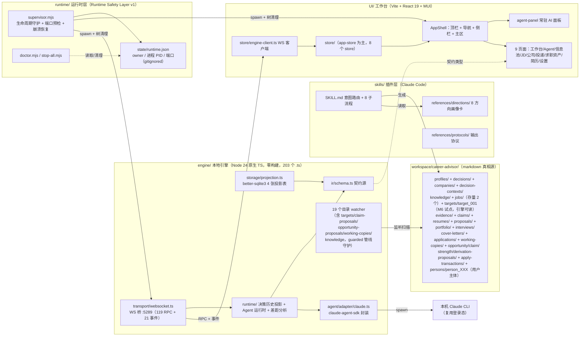

# Career OS 架构与现状总览

> 2026-08-16 校准 | 反映当前实现状态（M6 Target Intelligence 引擎进链 + M6.5 Person Foundation + P3-P6 机会/投递闭环 + 2026-08 断链审计修复），非愿景

## 0. 一句话概括

Career OS 是一个**基于证据链的职业决策 + Artifact Evolution 系统**（Decision → Evolution Pipeline）：输入方向/JD/公司/行业信息，经分析、映射、验证、决策，输出可验证职业资产（Resume / Portfolio / Interview）。三件套：`skills/`（Claude Code 插件：知识与分析协议源）+ `engine/`（本地 Node 引擎：markdown 真相源 → IR 契约 → SQLite 投影 → WebSocket RPC/事件）+ `UI/`（React 工作台：可视化 + 常驻 AI 面板）。



## 1. 三层职责

| 层 | 目录 | 职责 | 关键点 |
|----|------|------|--------|
| 技能层 | `skills/career-advisor/` | 分析协议与知识源：意图路由、8 子流程、8 方向画像卡、14 字段摘要协议 | Claude Code 插件，`--plugin-dir .` 加载；产出 markdown 真相源 |
| 引擎层 | `engine/` | markdown 真相源 → IR 契约 → SQLite 投影 → WS RPC/事件；Agent 对话通道；**Artifact 演化（Resume/Portfolio/Interview：Fact → Proposal → 用户决策 → 版本）** | Node 24 原生 TS（type-stripping，零构建、仅 erasable syntax）；**零依赖外部服务**（除 better-sqlite3/chokidar/ws/SDK） |
| 前端层 | `UI/` | 工作台可视化 + AI 对话 | React 19 + Vite 5 + MUI + zustand 5；浅色瑞士风默认 |
| 运行时层 | `runtime/` | 应用生命周期守护（横切启动层）：supervisor（recovery → 端口预检 → spawn → 统一关闭）+ stop-all + doctor | Node 24 原生 ESM，零依赖；runtime.json 原子写（gitignored） |

## 1.5 系统定位：Decision → Evolution Pipeline

Career OS 不是"决策分析系统"或"简历工具"的单一职责，而是**决策入口 + 资产演化出口**的闭环：

```
输入：方向 / JD / 公司 / 行业信息
        ↓
Decision Layer（分析、映射、验证、决策）
        ↓
Target Intelligence（M6：目标环境模型——Company Identity → Target 机会资产 → Context → Compatibility）
        ↓
Evidence Mapping（evidence/claims 事实层）
        ↓
Artifact Layer（可验证职业资产演化）
        ↓
输出：Resume / Portfolio / Interview
```

| 层 | 职责 | 资产 |
|----|------|------|
| Decision Layer | JD 分析、公司尽调、方向评估、差距分析、推荐 | decisions/ companies/ jobs/ knowledge/ |
| Target Intelligence（M6） | 目标环境模型：谁在招 / 岗位要什么 / 我怎么证明（Compatibility） | companies/（权威身份 = {公司名}.md）/ targets/（机会资产，引擎可读，试点 target_001） |
| User Intelligence（M6.5 冻结：Person Intelligence Bootstrap） | 用户主体模型：我是谁 / 我做过什么 / 技能边界 / 偏好限制——Snapshot + Events + Owner Protocol | persons/person_XXX（用户主体）：snapshot/identity、career_profile、skill_inventory、preference_constraints + events/ + experience/ |
| Evidence Mapping | 事实层——分析结论落为可消费事实，Artifact Fact 锚定于此 | claims/ evidence/ |
| Artifact Layer | 同一治理范式（Fact Preservation + Controlled Evolution + Projection）的独立实例 | resumes/ portfolio/ interviews/ cover-letters/ |

- 依赖单向：Decision → Evidence → Artifact；Artifact 演化不反向修改分析资产
- Artifact 间引用走 Artifact Reference Protocol（M4：Owner + Target Fact Locator + Relation，resolveLocator 只答存在性，无 registry）

## 2. 引擎架构

**单向依赖**（自上而下）：`transport/ runtime/ agent/ → storage/ → ir/` + `config.ts logger.ts`

```
engine/（203 个 .ts，node_modules 除外——完整清单以目录为准）
├── main.ts                 启动编排：config → workspace → logger → 投影 → WS 桥 → 19 个 watcher
│                           全部 watcher 回调经 guarded 守护（异常 → 日志 + error.engine 广播，不再击穿进程）
├── config.ts               CLI > env > config.json > 默认；fail fast（ConfigError）
├── logger.ts               应用日志（logs/engine.log，10MB×3 轮转）+ traces（logs/traces/）
├── ir/
│   ├── schema.ts           ★ 契约源：决策/公司/人/证据/Claim/岗位/投递/Target 等实体 +
│   │                       Validation + AgentError/AgentQuestion + ProtocolVersion='2.9'（引擎单方维护）
│   ├── resume.ts           ResumeDocument IR（claimId 必填主链 + 版本/Proposal IR + targetId/targetJobId 契约）
│   ├── portfolio.ts / interview.ts / cover-letter.ts / reference.ts / traceability.ts
│   │                       Artifact IR（M4：Fact→Evidence 模型、三层问答、NarrativeUnit 引用协议）
│   └── validator.ts        合法化 + 降级（必填缺失→invalid；值域非法→degraded）；validateByProtocol 按版本分派
├── storage/                markdown 真相源唯一出口（workspace.ts paths/read/write + 19 个目录 watcher）
│   ├── report/context/knowledge/evidence/claim/job/resume/proposal/portfolio/interview/
│   │   cover-letter/company/person/target watcher——各自目录 → IR → 变更广播
│   ├── claim-proposal/opportunity-proposal/strength/derivation/working-copy/application registry
│   │   ——提案域登记通道（Agent CLI 桥提交 + RPC 裁决；watch 已接线）
│   ├── decision-registry/artifact-registry 系统 ID 登记（引擎单方命名，不归 Agent）
│   ├── index-writer.ts     INDEX 决策记录/城市评估段落引擎投影（ADR-014：Agent 不得手写这两段）
│   ├── projection.ts       better-sqlite3 4 张投影表（decisions/timeline/persons/applications；SCHEMA_VERSION 7）
│   └── graph-builder.ts    图谱派生（pool/graph）
├── benchmark/              M3-3 Artifact Evolution Benchmark：确定性审计，无 AI Judge、无总分、无 ranking
├── context/career-context.ts AI Read Model（CareerContext 投影——AI 不直接读 IR）
├── runtime/                decision-runtime（历史投影）/ gap-calculator（差距分析，不打分）/
│                           claim-coverage/selector、evidence-coverage、jd-*、opportunity、observation、
│                           evolution-query、agent-runtime（任务注册表 + 权限挂起 + cancel）
├── export/resume-export.ts Resume PDF 导出（Edge headless，复现三元组 + checksum）
├── feedback/writer.ts      rewrite/feedback 事件记录（只记录不学习）
├── health/checker.ts       健康投影（--doctor 与 system/health 同一计算源）
├── agent/adapter/claude.ts claude-agent-sdk 封装：事件归一化 + 权限握手 + resume + 回答通道 + 思考事件
└── transport/
    ├── protocol.ts         ★ RPC 方法清单 + 事件清单（权威源，见下）
    └── websocket.ts        WS 桥 :5289（RPC + 事件广播 + 优雅关闭）
```

**WS 协议**（`transport/protocol.ts`，**119 个 RPC + 21 类事件**——完整清单以该文件为准，此表按域分组）：

| 域 | RPC（分组摘要） |
|-----|----------------|
| 系统 | system/init · system/health · settings/get\|update\|models |
| 决策 | decisions/list\|get\|update\|rescan · decision/history\|commit\|narrative-submit\|resume-context · contexts/list |
| 知识/图谱 | knowledge/graph · knowledge/gap · pool/graph |
| 公司/人 | companies/list\|get\|delete · persons/list · person/session/* · person/candidates/* · person/reset\|delete · person/summary-strengths/upsert · person/strength-proposals/list\|decide |
| 目标机会（M6） | targets/list · targets/get |
| 岗位 | jobs/list\|get\|create\|delete · jobs/match\|constraint-match\|match-score\|coverage\|extract\|analyze\|analyze-result · jobs/decision-draft |
| 证据/Claim | evidence/list · claims/list\|coverage\|select · claim-proposals/list\|create\|approve\|reject · claim-bridge/* |
| 简历 | resumes/list\|get\|clone\|transition\|diff\|export · resumes/alignment · resumes/derivation-proposals/list\|decide · working-copies/list\|upsert\|promote · claim-bind · opportunities/* |
| 提案/机会 | proposals/list\|accept\|reject · opportunity-proposals/* · strength/derivation 见上 |
| Artifact | portfolio/projects\|proposals/list + transition + accept\|reject · interviews/*（同型）· cover-letters/*（同型） |
| 治理 | artifacts/summaries · artifacts/timeline · artifacts/traceability/context · snapshot/archive\|versions · ledger/candidates\|commit\|reject\|list · evolution/why-changed\|replay\|recent |
| 投递 | applications/list\|create\|update-status\|delete\|link-decision |
| Agent | agent/start\|answer\|cancel\|permission · rewrite/feedback · ai/context |
| 简历导出 | resume/export（HTML→Edge headless→PDF） |

事件（21）：`data.{decisions,pool,jobs,evidence,claims,claim-proposals,opportunity-proposals,opportunities,working-copies,resumes,proposals,portfolio,strength-proposals,derivation-proposals,interviews,cover-letters,companies,applications,persons,targets}.changed` + `error.engine` + `agent.event`。变更信号均为"客户端重拉快照"语义。

## 2.5 Architecture Evolution（M3/M4 演进）

### Phase 1：Decision Intelligence（M1/M2）

JD → Decision → Career Mapping——决策分析为主（方向/城市/公司/JD 分析闭环）。

### Phase 2：Artifact Evolution（M3/M4）

Fact Layer → Proposal → Human Decision → Artifact Version

| 治理原则 | 含义 |
|----------|------|
| Fact Preservation | 事实层不可被 AI 修改——非法行为在 schema/parser/apply 中不存在（非运行时拦截） |
| Controlled Evolution | AI 只能经 Proposal 通道，用户确认后引擎确定性应用（append-only，永不覆盖） |
| Projection | 引擎确定性聚合（CareerContext/PortfolioContext/InterviewContext），不成为事实存储 |

Artifact：**Resume / Portfolio / Interview / Cover Letter**（M4-3 起为第一个 Projection Artifact）。

## 2.6 决策链六阶段体系建设现状（2026-08-16 盘点）

决策链 = 方向探索 → 转行评估 → 城市评估 → 公司筛选 → JD分析 → 简历定制。**前 3 阶段（JD 之前）**以技能层协议 + 决策记录为主（无独立资产体系）；后 3 阶段为 M1-M4 完整体系。决策链已按 ADR-008/ADR-010 降级为**决策历史视图**（四模块是分析视图非流程步骤）。

| 阶段 | skill 映射 | 技能层协议 | workspace 资产 | 引擎支持 | UI |
|------|-----------|-----------|---------------|---------|-----|
| 方向探索 | career-path | ✅ 8 方向画像卡 + path-scoring-model | ✅ 方向决策记录（决策明细段落） | ✅ 决策解析进链 | ✅ 方向视图（派生自 decisions，非 mock） |
| 转行评估 | career-transition | ✅ transition-model/gap-analysis/motivation-check | ✅ 决策记录 | ✅ 同上 | ✅ 决策链阶段展示 |
| 城市评估 | city-advisor | ✅ city-scoring-model/advisor-template | ✅ 城市评估决策记录（**cities/ 目录已废弃删除**） | ✅ 同上 | ✅ 城市视图（派生自 decisions；当前主体名下无有效城市评估——早期城市评估决策已按 ADR-014 摘归因） |
| 公司筛选 | company-screener | ✅ | ✅ companies/ 扁平档案（权威身份 = {公司名}.md + aliases）；company_001/ 为归档试点（引擎有意不解析，防双真相源） | ✅ companies/list（扁平档案） | ✅ 公司页 |
| JD分析 | jd-analysis | ✅ | ✅ jobs/（存量 2 个）+ targets/target_001（M6 试点：target/jd/requirement_matrix/compatibility，**引擎已进链 targets/list\|get**） | ✅ jobs/* + targets/* | jobs 页消费 jobs/list；targets UI 消费属 A3（未施工） |
| 简历定制 | resume-writing | ✅ CareerContentStandard | ✅ resumes/ + evidence/(14) + claims/(12) + proposals/ + portfolio/ + interviews/ + cover-letters/ | ✅ 全链路（M3/M4 + resume target_id 契约） | ✅ 简历中心 + Artifact Studio |

**结论**：
1. **Person 真相源已统一**：persons/person_XXX（用户主体）为唯一主体资产；profiles/ 已清空（陈旧合成人格已删除）；UI 隔离指令动态枚举登记档案，无 person id 硬编码
2. **M6 引擎侧已闭环（A1）**：targets watcher + IR + RPC + 事件 + target_001 回锚（candidate_person 更正为当前登记主体、original_jd_id 标 -）；生产链迁移（jd-analysis 写 targets/，A2）与 UI 消费（A3）未施工
3. **company 身份权威单一**：companies/{公司名}.md + aliases；company_001/ 归档残留仅供历史审计（ARCHIVED.md 声明）

## 3. 前端架构

**单向依赖**：`pages/ components/ → store/ → data/ → types/`

```
UI/
├── App.tsx              AppShell + ToastHost + GlobalAttentionCard + PermissionDialog
├── components/layout/   AppShell（顶栏/图标导航/次侧栏/主区/status-bar）+ agent-panel（常驻 350px AI 面板）
├── pages/               9 页：workbench（工作台）agent（决策 Agent）infopool（信息池图谱）
│                        jobs（JD）companies（公司探索）applications（投递管理）
│                        artifacts（求职资产/Artifact Studio）resumes（简历中心）settings
├── store/app-store.ts   唯一全局状态（zustand + persist 白名单，sessions 不持久化）+ engine-client/agent-phase/
│                        attention-store/navigation-state/person-capability/proposal-adapters/toast-store
├── data/mock-data.ts    演示数据唯一来源（真实接线的数据源除外；离线态才渲染）
├── data/constants.ts    设计 token（COLORS 是 CSS 变量引用，RISK_COLOR 是 solid hex）
└── types/index.ts       契约引用（import type 自 engine/ir/schema.ts，仅 UI 扩展字段本地定义）
```

关键交互：换人即换全局强调色（主题联动）；`startAnalysis(prompt)` 预置上下文 → AI 面板聚焦（所有"唤起 AI"入口走它）；agent-panel 与 agent 页共享同一会话（`currentSessionId`）；引擎错误经 `error.engine` → 全局 attention 错误卡（2026-08-16 接通）。

## 4. Agent 通道（真实 Claude CLI 对话）

```
UI 消息 → agent/start → engine agent-runtime → SDK query（spawn 本机 Claude CLI，复用登录态）
        → stream_event/assistant 消息 → 归一化 AgentEvent → agent.event 广播 → UI 流式渲染
```

事件流（`ir/schema.ts` AgentRuntimeEvent）：`text_delta` 流式文本 / `tool_start|tool_done` 工具 chips / `thinking_start|thinking_delta|thinking_stop` 思考指示器 + 折叠思考块 / `permission_request`（requestId 往返，前端弹窗决策）/ `question_request` AskUserQuestion 卡片 / `session_id`（resume 凭据）/ `done|error`。

已实测的 SDK 行为（SDK 0.3.220，管道模式）：AskUserQuestion 形状 = user 消息 `tool_use_result.questions[]`；管道模式提问立即跳过 → 回答走下一轮文本送达（`answer()` streamInput 通道 + resume 续接兜底）；思考：`system thinking_tokens` 实时进度（指示器源）+ assistant 消息 thinking 块全文（折叠展示）。

## 5. 数据流

```
markdown 真相源（workspace/career-advisor/）
  → watcher 监听（chokidar，19 个目录）→ 全量重扫 → IR 解析 + 校验（version 分派）
  → SQLite 投影同步（decisions/timeline/persons/applications）→ 广播变更信号 → UI 重拉快照（RPC）
```

- 引擎是投影方：markdown 是真源，SQLite 只是查询投影（可重建）
- 契约改动走版本演进（validator 按 version 分派），UI 无感知
- UI 离线（引擎未启动）→ 降级 mock 数据 + 状态栏"引擎离线"
- watcher 回调异常 → guarded 守护：日志 + error.engine 广播（管线错误用户可见，不再击穿进程）

## 5.5 数据边界：System Domain vs Workspace Domain

| 域 | 内容 | 位置 | git |
|----|------|-----|-----|
| **System Domain**（系统域） | 可执行逻辑、schema、工作流、prompt、模板 | `engine/` `skills/` `UI/`（代码） | 入库 |
| **Workspace Domain**（工作区域） | 用户职业数据：persons/ decisions/ companies/ evidence/ claims/ resumes/ 等 | `workspace/` | **永不提交**（gitignored） |

- 隐私红线：职业经历、成果证据、个人决策、薪资目标、面试记录是私人数字资产，**绝不进公开仓库**
- sanitize 防线：`scripts/sanitize-check.mjs`（pre-commit + npm test 双拦截；2026-08-16 修复中文路径盲区 quotepath=false）；**PNG 二进制零覆盖**（截图策略见 AGENTS.md）
- 版本标记：`workspace/career-advisor/metadata/protocol.json`（引擎单方维护；版本漂移时 initWorkspace 回写当前 ProtocolVersion，created 保留）

## 5.6 Runtime Health（健康投影）

统一健康报告层，**Health Engine（`engine/health/checker.ts`）是唯一计算源**——CLI 与 UI 禁止各自实现健康计算。

- 四维度投影：workspace / decisions / graph / knowledge（`HealthReport` 契约 v1，`ir/schema.ts`）
- Consumers：`--doctor` CLI、`system/health` RPC、WebUI 角标（工作台卡片 / 信息池 / status-bar）
- 报告**一致性/完整性问题**，不执行自动修复或数据迁移（Detection ≠ Remediation）；空数据源按空维度 score=100 诚实处理

## 5.7 Resume Export（简历产物出口）

- 前端组装打印 HTML（HTML 转义防注入）→ `resume/export` RPC → 引擎 spawn Windows 自带 Edge `--headless --print-to-pdf`（零依赖）→ base64 返回 → 前端 Blob 下载
- 离线/Edge 缺失 → 降级 `window.print()`（Print CSS 隐藏应用壳）

## 6. 部署与进程生命周期

```
StartWebUI.bat（双击）→ runtime/supervisor.mjs（Runtime Safety Layer v1）
  ├─ engine:  .local/node/node.exe main.ts   → WS :5289
  └─ ui:      .local/node/node.exe vite      → :5288（strictPort）
```

- **环境隔离**：内置便携 node `.local/node/node.exe`；一切运行时/依赖在项目根内
- **Runtime Safety Layer v1**：supervisor 持有生命周期（runtime.json 原子写、PID 归属验证、端口预检、统一关闭、启动自愈）
- 引擎优雅关闭：SIGINT/SIGTERM → `handle.shutdown()`（中止活跃 Agent 任务）→ 800ms 后退出
- 端口：5288（UI）/ 5289（引擎 WS），strictPort 防漂移
- Job Object（父死必清）为 Future Enhancement：`runtime/native/windows-job-object.md`

## 7. 测试与验证

| 层 | 手段 | 入口 |
|----|------|------|
| 引擎 | node:test + 真实 CLI smoke | `npm test`（**683 用例全绿，2026-08-16**）、`npm run smoke:bridge/handlers/question` || Benchmark | engine/benchmark 确定性审计 + dataset/cases 10 例 | runner/report 测试（无 AI Judge、无总分） |
| 前端 | tsc --noEmit | `npm run typecheck`（UI） |
| 端到端 | Playwright（MCP）驱动真实浏览器 + 真实 CLI | 手工驱动；2026-08-16 已实测：创建新人→初始化会话 WS 帧捕获、离线 mock 渲染、targets/list\|get、claim-proposals watcher 广播 |
| 数据 | `--scan-decisions` 验收入口 | 一次性扫描 → 控制台 IR + Validation |
| 边界 | sanitize-check（pre-commit + npm test 拦截） | 文本全量扫描；PNG 盲区人工复核 |

## 8. 落地状态与路线

**已完成（累计）**：引擎骨架 → 决策解析 → 桥接+投影 → Agent 适配层（提问/权限/回答/resume/思考）→ 决策链状态机 → 上下文聚合 + 复盘闭环 → 知识层 + 差距分析 → 进程生命周期 + 一键启动 → 健康投影 → 简历改写 → PDF 导出 → Runtime Safety Layer v1 → M3 表达链路（M3-0→M3.5.8）→ M3-3 Benchmark → M4 Artifact Evolution（Portfolio/Interview/Cover Letter + Reference Protocol + 治理 UI）→ M6 Target Intelligence 协议层 → M6.5 Person Bootstrap（协议冻结）→ P3-P6 机会/投递闭环（观察统计）。

**2026-08-14/16 断链审计修复（详见 docs/audits/Career-OS-断链审计-v1.md，本地）**：
- **A1 targets 引擎进链**：workspace 路径 + TargetRecord IR + target-watcher + targets/list|get RPC + data.targets.changed 事件 + target_001 回锚（candidate_person 更正为当前登记主体）+ 合成 fixture 测试 6 例
- **身份链修复**：城市评估错账摘归因（ADR-014）；profiles/ 陈旧合成人格清理；UI 隔离指令动态枚举；跟踪文件真实 person id 全量清理；**用户姓名（占位问候语）全链替换为真实姓名**（persons/person_XXX）
- **INDEX 治理**：公司尽调表断链修复；skill 协议明确 INDEX 段落所有权（决策/城市段引擎投影，Agent 禁手写）
- **信号面补齐**：claim-proposals/opportunity-proposals/knowledge/working-copies watcher 接线；error.engine 管线守护广播 + UI 全局错误卡；opportunitiesChanged 订阅
- **契约面校准**：ProtocolVersion 收敛 2.9（protocol.json 漂移回写、skill 模板 2.9、engine/CLAUDE.md 校准）；sessions_projection 死表移除（SCHEMA_VERSION 7）；孤儿 .db/.write-probe 清理 + WAL checkpoint；sanitize 中文路径盲区修复（quotepath=false）
- **ADR-009 校准**：Evidence `owner` 已落地（claims 12/12、evidence 14/14）；**`epistemic_status` 三态未实现**（语义与 EvidenceVerification 关系未定义，标准缺失——按 ADR-006 先立标准再实现，从"已完成"撤销为"未施工"）

**未施工（勿提前）**：
- **A2 targets 生产链迁移**：jd-analysis skill + jd-analysis-writer 从 jobs/ 改 targets/；存量 2 个 JD 迁移（留到下一次实际跑 JD 分析时执行）
- **A3 targets UI 消费**：jobs 页改读 targets 或新增视图；简历 target_id 解析对齐
- **F11 M7 去留裁决**：ledger/evolution/snapshot RPC 引擎已建但 UI 零消费、文档标"M7 不做"——三方矛盾待裁决
- **F12 mock/真实混显**：首屏虚构实体演示标识；resumes 页 mock/engine 双轨；mock 家人A profilePath 悬空
- **F16 边界补强**：sanitize 清单加类目（人名/城市/person id）；PNG 截图盲区人工复核
- **ADR-009 epistemic_status**：标准缺失（语义未定义），触发条件未到
- V3 愿景——Person Model 五维、决策发现、Career Map、Evidence 原子模型 / Workflow Contract / Career Graph 推理层（ADR-003/004/005 登记 defer）

**已完成（2026-08-03）**：Career Expression Standard Phase 1（机械工程）——12 岗位 JD 调研 → Signal Taxonomy → CareerContentStandard 契约 v1.1；Career Claim Intelligence 验证（H1/H2/E1）沉淀 evidence-patterns/（文档层知识资产，非运行时层）。

**进行中（Phase 2 Resume Intelligence Runtime）**：2C 观察窗口（真实 UI 使用 → 入口形态决策）待用户使用。

## 9. 开发原则（CLAUDE.md 摘要）

1. 高内聚：模块职责单一，逻辑聚合在所属模块
2. 低耦合：模块间稳定接口，不渗透实现细节
3. 单向依赖：页面 → store → 数据层 → 常量，禁反向/循环
4. 禁止兜底：只在系统边界（用户输入、外部 API、文件系统）校验，信任内部契约
5. 环境隔离：运行时与依赖必须在项目根内；禁全局安装、禁改系统 PATH
6. 标准优先于 Prompt：Agent 行为问题优先修标准（失败分类 A/B/C/D，ADR-006）
7. 产物留在项目根内：docs/、.local/、workspace/ 等，禁止外部环境
8. Artifact Producer Ownership：Agent 产生判断，Engine 产生事实；身份/关联/状态字段必经 Registration Owner

## 10. 文档权威链（Documentation Authority）

| 层 | 来源 | 回答 |
|----|------|------|
| L0 Product Intent | `docs/CAREER-OS-开发方案-v1.md` | 为什么存在 |
| L1 Architecture | 本文档（根目录 ARCHITECTURE.md） | 系统如何组织 |
| L1.5 Module Conventions | `engine/CLAUDE.md` `UI/CLAUDE.md` | 模块级实现约定 |
| L2 Implementation Contracts | `docs/contracts/*-contract-vN.md` | 当前这块怎么实现 |
| Decision Records | `docs/ADR/` | 为什么选/为什么延期/何时 revisit |
| Audits | `docs/audits/`（gitignored） | 审计基线 + 修复台账 |

**冲突解决**：Contract > 模块约定 > Architecture > 产品意图；历史文档仅作参考。
**边界**：`docs/` 为内部工程资产（gitignored）；公开仓库 = 产品面（README + 本文档 + 代码）。

**本文档描述当前已实现的系统边界；未来方向由 ADR 单独登记**——不是 roadmap，不被当作愿景讨论区。
