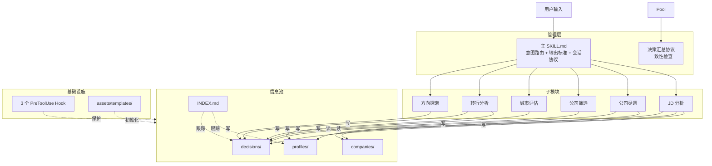
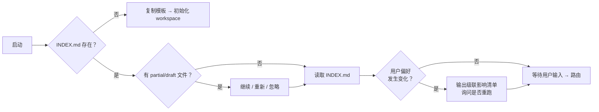

## 架构

career-advisor 采用**管理层 + 信息池**模式，解决多步骤决策分析的数据共享和一致性。

---

### 一、系统架构



### 二、通信模型

**子模块之间不直接通信。** 所有数据通过信息池中转：

```
子模块结束 → 写 workspace/career-advisor/decisions/{日期}-{主题}.md
           → 更新 workspace/career-advisor/INDEX.md

后续子模块 → 读 INDEX.md → 发现前序数据 → 按需消费 decisions/
```

每个子模块输出固定格式的 `## 分析摘要` 表格（14 字段），供后续模块和决策汇总协议消费。

### 三、信息池结构

```
workspace/career-advisor/
├── INDEX.md              ← 工作目录索引（用户画像 + 决策记录 + 城市/公司表）
├── profiles/             ← 用户画像（每用户一文件）
│   └── {用户名}.md
├── decisions/            ← 决策记录（不可变，追加写）
│   └── {YYYY-MM-DD}-{主题}.md
├── companies/            ← 公司尽调报告
│   └── {公司名}.md
└── exports/              ← 综合结论交付件
    └── {YYYY-MM-DD}-综合结论.md
```

### 四、数据保护

3 个 PreToolUse Hook：

| Hook | 拦截范围 | 行为 |
|------|----------|------|
| `block-delete-workspace.js` | `rm/del/rmdir` 含 workspace | 阻止执行，提示手动操作 |
| `guard-sensitive-writes.js` | 写入 profiles/、decisions/、INDEX.md | 警告确认（不阻止） |
| `validate-decision-name.js` | 写入 decisions/ | 验证 `YYYY-MM-DD-{主题}.md` 格式 |

配置在 `.claude/settings.local.json`：

```json
{
  "hooks": {
    "PreToolUse": [
      { "matcher": "Bash", "hooks": [{"command": "node scripts/block-delete-workspace.js"}] },
      { "matcher": "Write|Edit", "hooks": [{"command": "node scripts/guard-sensitive-writes.js"}] },
      { "matcher": "Write", "hooks": [{"command": "node scripts/validate-decision-name.js"}] }
    ]
  }
}
```

### 五、会话生命周期



### 六、输出标准

每个子流程结束输出 14 字段摘要表：

| 字段 | 必填 | 说明 |
|------|:--:|------|
| skill | 是 | 来源子流程名称 |
| direction | 条件 | 方向/转行/JD 分析必填 |
| direction_match | 否 | 匹配度 % |
| direction_confidence | 否 | 高/中/低 |
| city | 条件 | 城市评估/筛选必填 |
| city_score | 否 | X/10 |
| city_confidence | 否 | 高/中/低 |
| salary_feasible | 否 | true/false |
| companies | 条件 | 涉及的公司名。尽调/JD 必填 |
| company_rating | 否 | 推荐/谨慎推荐/不推荐 |
| risk_level | 是 | 低/中/中高/高 |
| key_risk | 是 | ≤30 字 |
| status | 是 | complete/partial/draft |
| protocol_version | 是 | 2.0 |

### 七、决策汇总协议

当用户说"出结论"/"总结"/"下一步"时：

1. 读 INDEX.md → 枚举已完成分析
2. 从 decisions/*.md 提取全部摘要表 → 构建汇总矩阵
3. 运行 6 项一致性检查（方向/城市/薪资/风险/置信度/硬约束）
4. 标注缺失分析步骤
5. 输出双文件：`decisions/{日期}-综合结论.md`（内部）+ `exports/{日期}-综合结论.md`（用户版）
6. 置信度降级：≤2 skill→低；存在矛盾→低；5-6 skill 无矛盾→可升为高

### 八、文件命名约定

| 项目 | 规则 |
|------|------|
| 日期格式 | YYYY-MM-DD |
| decisions/ | `{YYYY-MM-DD}-{主题}.md`（不可变，追加写） |
| profiles/ | `{用户名}.md` |
| companies/ | `{公司名}.md` |
| 缺失值 | 填 `-`，不填 `暂无`/`N/A` |
