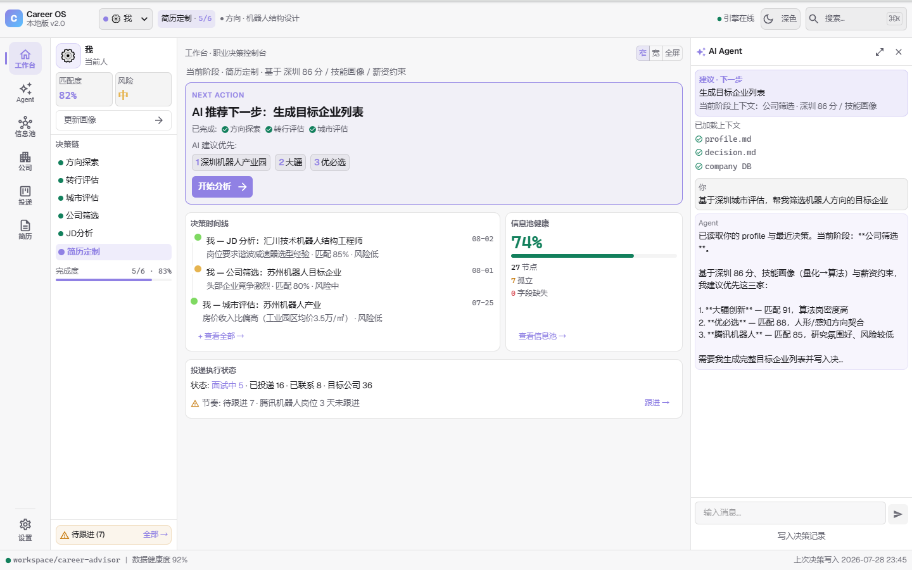
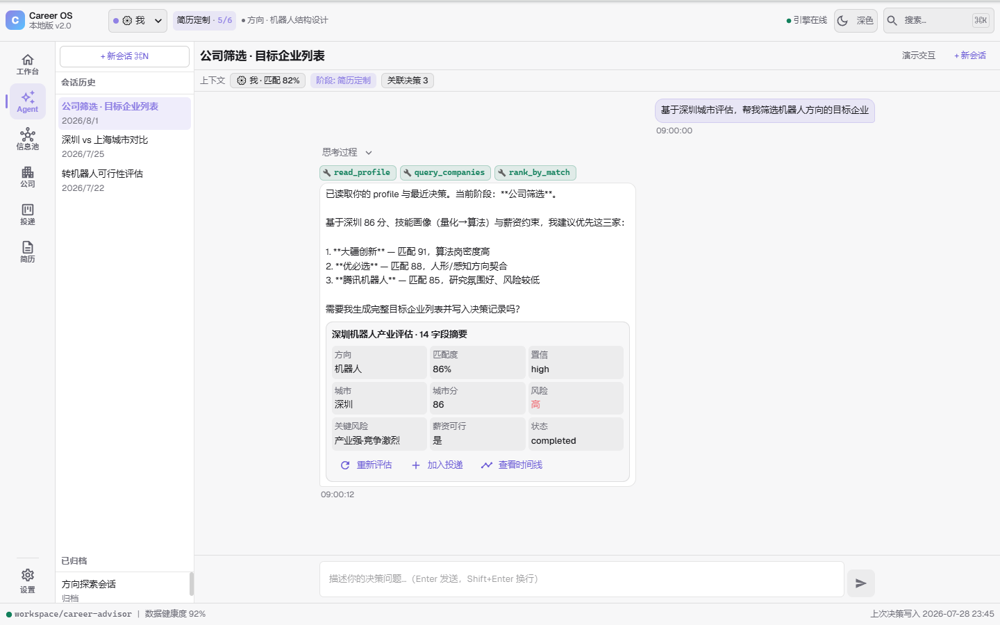
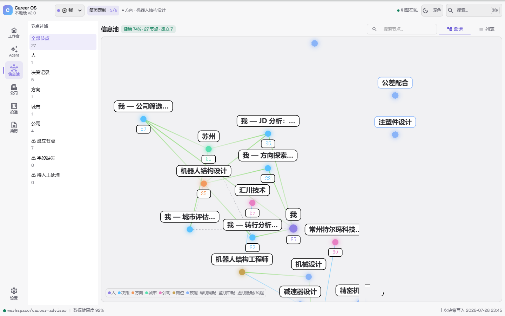
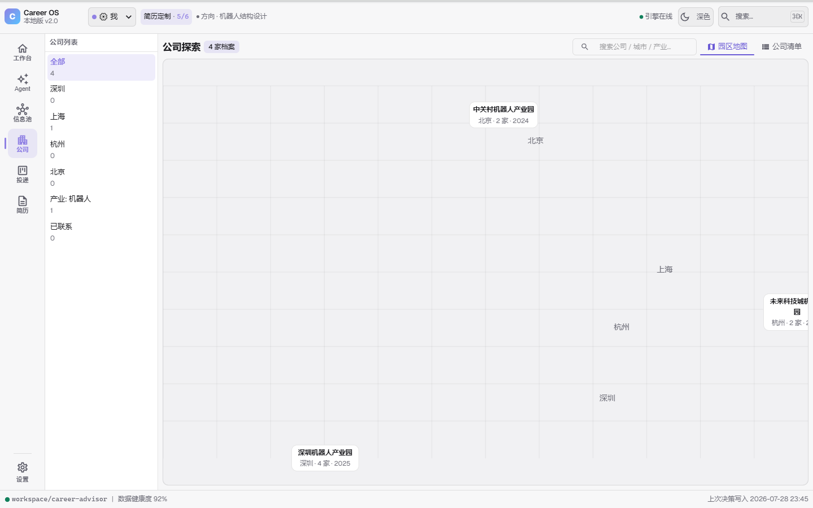
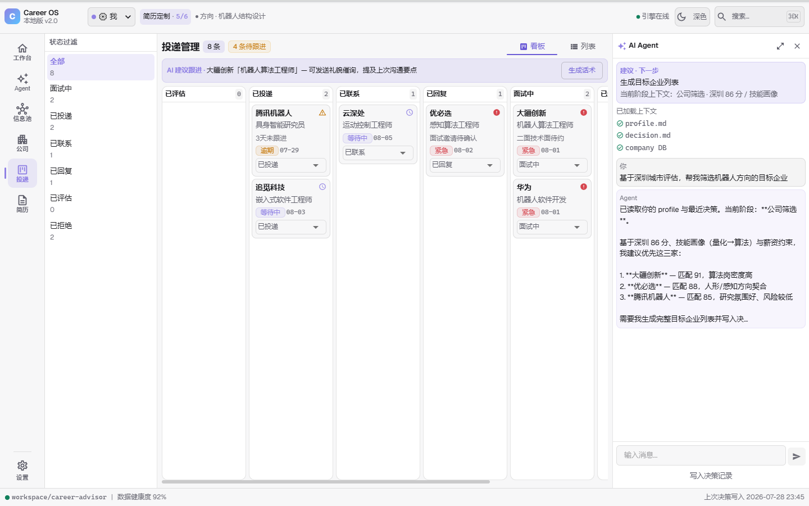
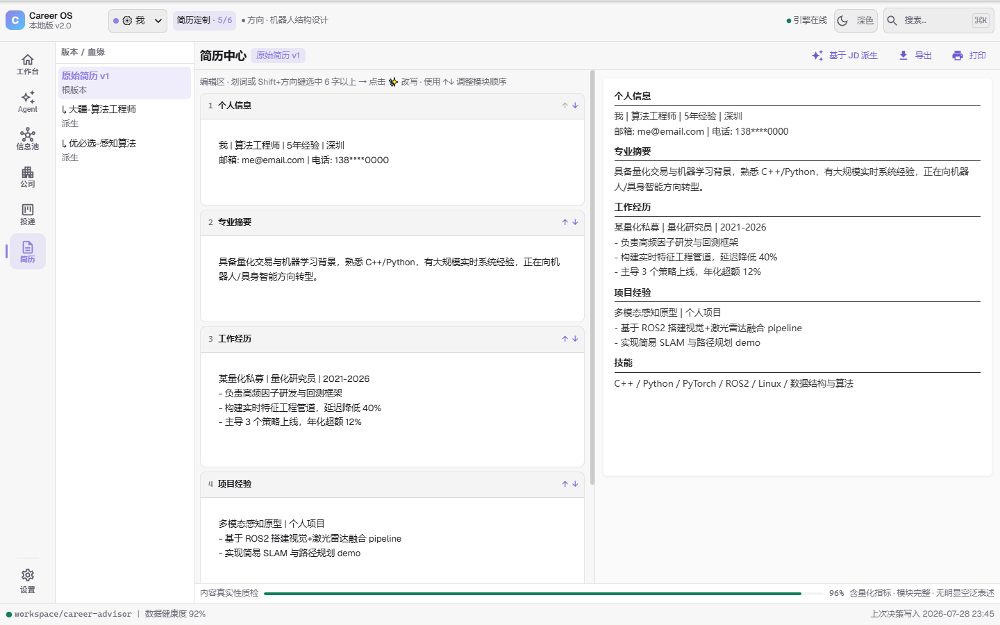

<div align="center">

# Career OS

**The most expensive part of a job search isn't sending resumes. It's picking the wrong direction.**

Describe your situation in one sentence. Get an executable, data-backed career decision —
from direction exploration to resume writing, covering the full decision chain.

[](LICENSE)


[English](README.en.md) | [中文](README.md)

</div>

---

## What You Get

| You say | What the system does | What you get |
|---------|----------------------|--------------|
| "Help me write a resume" | Frontier interrogation → STAR reconstruction → direction-specific standards | A resume with quantified achievements, ready to submit |
| "Is this JD legit?" | Match scoring + euphemism translation + interview prediction | The JD's real intent + your odds |
| "What direction should I go?" | Skills / interest / market profile → ikigai matching | Ranked candidate directions |
| "Can I move from mechanical design to robotics?" | Skill overlap + financial model + risk adjustment | Whether to switch, how, and the first step |
| "Suzhou or Shenzhen?" | City scoring + industry fit + salary comparison | A data-backed city choice |
| "What good companies are in Suzhou?" | Specialty / funding / hiring signal scanning | A shortlist of target companies |
| "What about this company?" | 7-chapter due diligence + 10 interview questions to ask | A due-diligence report |
| "Give me a conclusion" | Aggregation matrix + consistency check | Final recommendation |

## A Completed Decision Chain

**Li Ming, 28, non-standard automation mechanical engineer (Changzhou), wants to move into robotics after a 10-month grad-school gap.**
Walked the full chain with career-advisor: transition feasibility (75% match, soft landing in Suzhou) → city evaluation (Suzhou 8.2/10) → company screening → due diligence → final conclusion.

→ Read the full case study: [docs/case-studies/2026-07-李明-非标自动化转机器人.md](docs/case-studies/2026-07-李明-非标自动化转机器人.md) (Chinese, virtual test user)

## Screenshots

<table>
<tr>
<td><br/><sub>Workbench: decision chain + next action</sub></td>
<td><br/><sub>Decision Agent: real LLM chat (streaming / question cards / permission dialogs)</sub></td>
</tr>
<tr>
<td><br/><sub>Info pool: decisions / companies / directions / cities graph</sub></td>
<td><br/><sub>Company explorer: target list + due diligence entry</sub></td>
</tr>
<tr>
<td><br/><sub>Applications: application progress board</sub></td>
<td><br/><sub>Resume center: AI rewrite + JD-driven derivation</sub></td>
</tr>
</table>

## Quick Start

**Option 1: Local workbench (recommended)**

```bash
git clone https://github.com/Friend-Xu/career-os.git
cd career-os
node runtime/supervisor.mjs     # Windows: double-click StartWebUI.bat (bundled portable node, no system Node needed)
```
Stop: `node runtime/stop-all.mjs` or double-click stop-all.bat · Diagnose: `node runtime/doctor.mjs`.

Open **http://localhost:5288**: decision chains, info-pool graph, company due diligence and application boards, all visualized. The "Decision Agent" panel chats with a real LLM (reuses your local Claude CLI login — streaming replies, question cards, permission dialogs, thinking process).

The `workspace/` directory is created automatically on first run. No setup required. Full workflow: [ARCHITECTURE.md](ARCHITECTURE.md).

## Runtime & Process Lifecycle (Runtime Safety Layer)

The engine and frontend are supervised by `runtime/supervisor.mjs` — solving "processes left behind on close / can't start next time":

| Action | Command |
|--------|---------|
| Start | `StartWebUI.bat` (or `node runtime/supervisor.mjs`) |
| Stop | `stop-all.bat` (or `node runtime/stop-all.mjs`) — closing the window directly leaves processes behind, use this entry |
| Diagnose | `node runtime/doctor.mjs` — first step when the app won't open |

Guarantees:

- **Duplicate instance**: second start is refused with a clear message
- **Crash recovery**: orphans from a previous crash (force-kill / blue screen / window close) are cleaned up on next start — only processes verified to belong to this project are touched
- **Port conflict**: if :5288/:5289 is held by an external program, startup fails with an explicit error (port + PID + command line) — no silent port switching, no EADDRINUSE crash
- **Unified shutdown**: Ctrl+C / Ctrl+Break / window close all trigger the same cleanup sequence; deletion of `runtime.json` marks a clean shutdown

> Process ownership is decided by command-line verification (PID alive + belongs to this project). Ports are symptoms, never the basis for killing.

**Option 2: Claude Code plugin (optional)**

```bash
claude --plugin-dir .
```

Then just say what you need in Claude Code: `"help me write a resume"` / `"is this JD legit?"` / `"what direction should I go?"` / `"which city should I choose?"` / `"give me a conclusion"`.

## What We Believe

Career decisions are low-frequency, high-impact events — so quality rules are built into every module:

- **No comfort, no false hope** — hard is hard; give "how to start," not "you can do it"
- **Human in the loop** — AI analyzes, you decide; a "don't switch yet" verdict keeps warning in every output, never bypassed
- **Financial constraints are the hardest** — with less than 3 months of runway and family obligations, no quitting without a job
- **If we can't find it, we say so** — every data point carries a source and year; inferences are labeled `[inference]`

Full principles: [docs/PRINCIPLES.md](docs/PRINCIPLES.md).

## Use with Other AI CLIs

All career-advisor skills are plain Markdown, so they can be copied to any CLI that supports agent skills:

```bash
bash scripts/install-to-cli.sh --codex   # copy to Codex skills directory
```

Search-tool support varies by CLI — see the [CLI compatibility matrix](docs/CLI-COMPATIBILITY.md).

## Privacy Notice

Career OS strictly separates **system assets** from **personal career data**:

- **The repository contains**: schemas, templates, workflows, agent definitions, engine and workbench code
- **Your workspace contains** (`workspace/`, gitignored): career history, achievements, evidence, personal decisions, salary goals, interview records

**Never commit your `workspace/` to public repositories.** Your career records are private digital assets that belong only to you, locally. Full data-boundary definition: [ARCHITECTURE.md](ARCHITECTURE.md).

## License

[GNU GPL v3](LICENSE)
