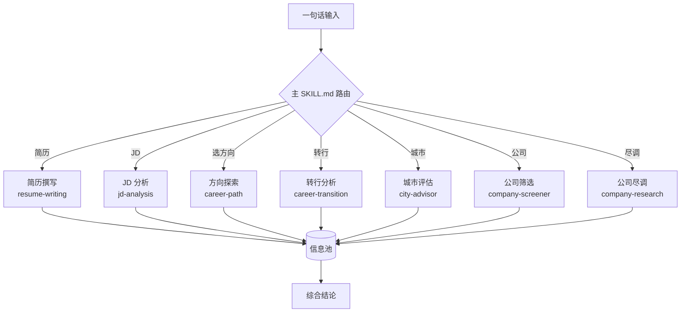

# career-advisor

**Claude Code 插件 — 职业决策分析系统。**

一句话输入，输出可执行的职业决策。从方向探索到简历撰写，覆盖求职决策全链路。

## 工作流



## 功能

| 步骤 | 你能问 | 输出 |
|------|--------|------|
| 简历撰写 | "帮我把工作经历写成简历" | frontier 追问挖掘 + STAR 重构 + 双版本输出 |
| JD 分析 | "看看这个 JD 靠不靠谱" | 匹配度 + 委婉语翻译 + 简历定制 + 面试预测 |
| 方向探索 | "我该做什么方向？" / "我是机械专业的" | 职业方向排序 + ikigai 匹配 |
| 转行分析 | "机械设计转机器人可行吗" | 技能审计 + 差距分析 + 行动计划 |
| 城市评估 | "机械工程师去苏州还是深圳" | 城市评分 + 产业匹配 + 薪资对比 |
| 公司筛选 | "苏州有什么好公司" | 专精特新/融资/招聘多维信号清单 |
| 公司尽调 | "这家公司怎么样" | 7 章节背调报告 + 面试反问十问 |
| 综合结论 | "出个结论" | 汇总矩阵 + 一致性检查 + 最终建议 |

## 快速开始

### 安装

```bash
git clone https://github.com/Friend-Xu/career-advisor.git
cd career-advisor
claude --plugin-dir .
```

或在 Claude Code 中 `/plugin install` 后直接输入 `/career-advisor`。

### 使用

直接说你的需求：

```
"帮我写简历"
"分析一下这个 JD"
"我该做什么方向"
"机械设计转机器人可行吗"
"去哪个城市发展比较好"
"苏州有什么好公司"
"帮我查一下 XX 公司"
```

首次使用系统会自动创建工作目录，无需手动配置。

## 项目结构

```
career-advisor/
├── .claude-plugin/plugin.json   ← 插件定义
├── .claude/settings.local.json  ← Hook 配置
├── skills/career-advisor/
│   ├── SKILL.md                 ← 主入口（路由 + 输出标准 + 汇总协议）
│   ├── sub-skills/              ← 7 个子模块
│   │   ├── resume-writing/      ┐
│   │   ├── jd-analysis/         │
│   │   ├── career-path/         ├─ 每个含 SKILL.md + references/
│   │   ├── career-transition/   │
│   │   ├── city-advisor/        │
│   │   ├── company-screener/    │
│   │   └── company-research/    ┘
│   ├── references/              ← 共享参考数据（8 专业画像卡 + 3 协议）
│   ├── assets/templates/        ← workspace 初始化模板
│   └── examples/                ← 完整示例（虚拟用户"李明"）
├── scripts/                     ← Hook 脚本
├── AGENTS.md / CLAUDE.md        ← 项目入口
└── ARCHITECTURE.md              ← 架构说明
```

## 依赖

| 工具 | 用途 | 来源 |
|------|------|------|
| WebSearch | 中文搜索 | Claude Code 内置 |
| WebFetch | 深度阅读 | Claude Code 内置 |
| Exa MCP | 语义搜索（推荐） | ECC 插件 / exa.ai |

Exa MCP 可选但强烈推荐。在 `.mcp.json` 或 `~/.claude.json` 中配置：

```json
{
  "mcpServers": {
    "exa": {
      "type": "http",
      "url": "https://mcp.exa.ai/mcp",
      "headers": { "Authorization": "Bearer <your-key>" }
    }
  }
}
```

免费 API Key 在 [exa.ai](https://exa.ai) 注册。

## License

MIT
