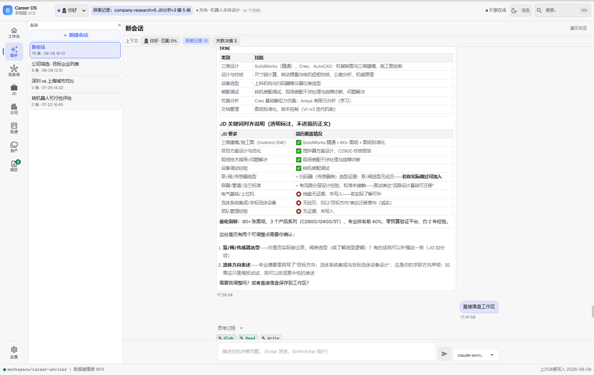
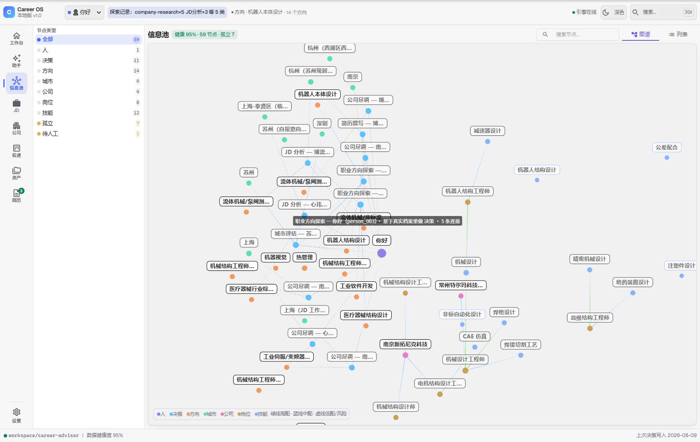
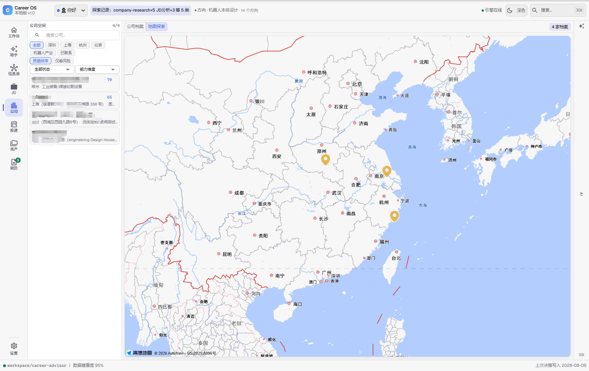
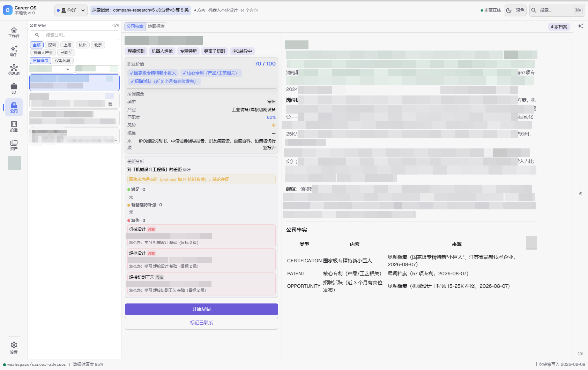
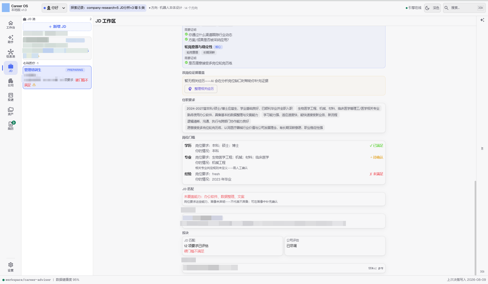
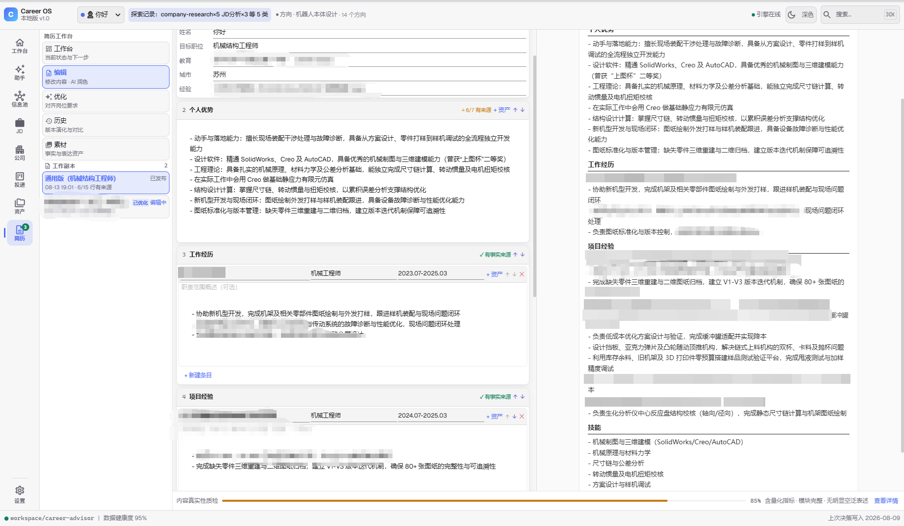
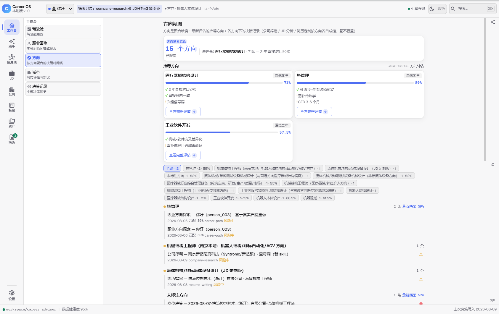
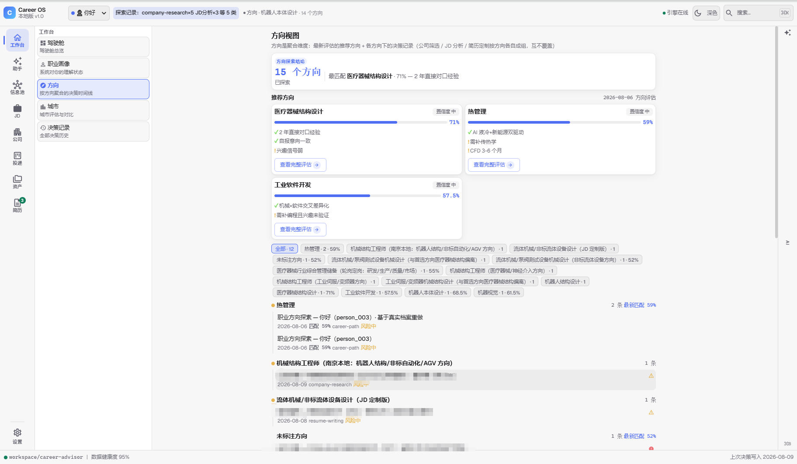
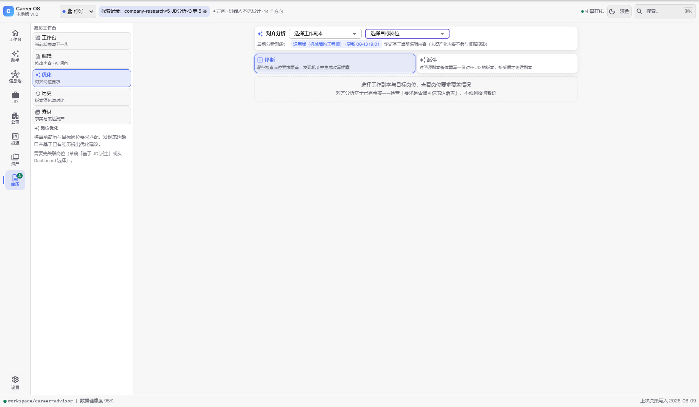

<div align="center">

# Career OS

**求职最贵的不是投简历，是选错方向。**

一句话描述你的处境，输出有数据支撑、可执行的职业决策——
从方向探索到简历撰写，覆盖求职决策全链路。

[](LICENSE)


[中文](README.md) | [English](README.en.md)

</div>

---

## 你能得到什么

| 场景 | 系统做什么 | 你得到 |
|------|-----------|--------|
| 建立职业档案 | 简历 / 访谈双通道采集，AI 提取候选事实，你确认后写入画像 | 职业画像：技能 / 目标 / 方向 / 证据状态一目了然 |
| 知道下一步 | 画像状态驱动 Next Action + 引导卡片 + 导航角标 | 明确的行动入口，不迷路 |
| 探索职业方向 | 决策 Agent 基于画像分析候选方向，产出写入决策记录 | 方向决策，工作台时间线可回溯 |
| 分析 JD / 尽调公司 | Agent 拆解要求、评估匹配、调研公司，产出决策记录 | 决策记录 + 信息池图谱节点 |
| 定制简历 | 基于 JD 派生 + 划词 AI 改写 + 版本管理 | 简历版本（可直接投递） |
| 管理投递 | 申请进度看板 + 跟进优先级 | 投递状态不失控 |

工作台（:5288）把以上全部投影为可视化资产：职业画像 / 决策时间线 / 信息池图谱 / 简历中心 / 投递看板；右上角「决策 Agent」与真实 LLM 协作（流式回复 / 提问卡片 / 权限确认）。

## 一个走完的决策链

**李明，28 岁，非标自动化机械工程师（常州），10 个月考研 Gap 后想转机器人方向。**（**虚拟测试用户**，用于演示系统全链路，非真实案例；公司为化名。）
在 Career OS 中走完：转行可行性分析（技能重叠度 44% → 跳板路径：非标自动化 → 机电一体化 → 机器人，先在职补齐差距，不裸辞）→ 城市评估（苏州 8.2/10，机器人产业聚集度 9/10）→ 公司筛选 → 公司尽调 → 综合结论。

→ 阅读完整决策链记录：[docs/case-studies/2026-07-李明-非标自动化转机器人.md](docs/case-studies/2026-07-李明-非标自动化转机器人.md)

## 界面预览

<table>
<tr>
<td><br/><sub>工作台：决策时间线 + 下一步行动</sub></td>
<td><br/><sub>决策 Agent：真实 LLM 对话（流式回复 / 提问卡片 / 权限弹窗）</sub></td>
</tr>
<tr>
<td><br/><sub>信息池：决策 / 公司 / 方向 / 城市图谱</sub></td>
<td><br/><sub>公司探索：地图视图 + 目标公司列表</sub></td>
</tr>
<tr>
<td><br/><sub>公司尽调：职业价值评分 + 风险信号</sub></td>
<td><br/><sub>JD 工作区：岗位门槛四态 + 引擎匹配度 + 投决区</sub></td>
</tr>
<tr>
<td><br/><sub>投递管理：申请进度看板</sub></td>
<td><br/><sub>简历中心：版本工作区 + 划词 AI 改写</sub></td>
</tr>
<tr>
<td><br/><sub>方向视图：按方向聚合的决策时间线 + 推荐方向</sub></td>
<td><br/><sub>职业方向探索：方向决策与匹配度</sub></td>
</tr>
<tr>
<td colspan="2" align="center"><br/><sub>基于 JD 优化简历：缺口驱动的简历派生提案</sub></td>
</tr>
</table>

### 工作台能力

- **职业画像视图**——"系统如何理解你"的状态镜像：身份 + AI 叙事摘要 + 画像地图（中心人物 + 六维画像节点，节点状态 = 证据状态：实心已建立 / 空心呼吸待确认 / 虚线推断或未建立，不画关系线）+ 画像状态与内容（覆盖维度 / 证据计数 / 技能条 / 目标意向）。主体是 Person，不是 AI
- **Attention 引导**——浮层卡片（事件跳转）+ 导航角标（持续状态）+ 页面空态（落点 Action）三件套，回答"下一步在哪里"，不打扰不常驻
- **Agent 任务状态条**——工作台 Action 点击即启动任务（新会话 + 立即执行，任务标题即会话名），Agent 界面显示「任务名 · 正在分析 · 计时」持续不闪灭
- **初始化生命周期**——简历 / 访谈双通道建档（AI 提取候选 → 用户确认 → 写入画像），完成前门控画像依赖行为，浏览与历史恒开放

## 快速开始

**方式一：本地工作台（推荐）**

```bash
git clone https://github.com/Friend-Xu/career-os.git
cd career-os
node runtime/supervisor.mjs     # Windows 也可双击 StartWebUI.bat
```
依赖安装自动完成：首次运行若发现依赖缺失（`node_modules/` 不入库），supervisor 自动执行 `npm ci` 按 `package-lock.json` 精确复现（约 1-3 分钟，需网络）；也可手动执行 `node scripts/install-deps.mjs`。要求 Node 24+：**运行环境使用项目内置便携 Node（`.local/node/`，必需依赖——缺失时启动明确报错并提示安装，不静默回退）**；系统 Node 仅用于首次安装引导（`install-deps.mjs`）。

关闭：`node runtime/stop-all.mjs` 或双击 stop-all.bat；诊断：`node runtime/doctor.mjs`。

打开 **http://localhost:5288**：决策链、信息池图谱、公司尽调、投递看板全部可视化；右上角「决策 Agent」直接与真实 LLM 对话（引擎直连服务商，支持流式回复 / 提问卡片 / 权限弹窗 / 思考过程）。

首次使用自动创建 `workspace/` 工作目录，无需配置。完整工作流见 [ARCHITECTURE.md](ARCHITECTURE.md)。

## 引擎与数据

引擎（Node 24 原生 TS，`engine/`）解析 markdown 真相源并提供 WebSocket 桥（:5289）；UI（Vite，`UI/`）为可视化工作台（:5288）。项目内置便携 node（`.local/node/`，**必需运行依赖**）——缺失时启动明确报错并提示安装方式，不自动下载、不静默回退系统 Node。

**端口与配置**：

| 项 | 值 |
|----|----|
| UI | http://localhost:5288 |
| 引擎 WS | ws://127.0.0.1:5289（仅本机回环；端口冲突由运行时层启动前拒绝，不自动漂移） |
| 配置 | `career-os.config.json`（首次运行生成，来源优先级 CLI > env > 文件 > 默认） |
| 日志 | `logs/engine.log`（10MB×3 轮转）+ `logs/traces/`（会话轨迹 jsonl） |
| 数据 | `workspace/career-advisor/`（profiles/ decisions/ companies/，gitignored） |

## 运行时与进程生命周期（Runtime Safety Layer）

引擎与前端由 `runtime/supervisor.mjs` 统一守护——解决"关闭残留进程 / 下次启动失败"：

| 操作 | 命令 |
|------|------|
| 启动 | `StartWebUI.bat`（或 `node runtime/supervisor.mjs`） |
| 停止 | `stop-all.bat`（或 `node runtime/stop-all.mjs`）——直接关窗口会残留进程，请用此入口 |
| 诊断 | `node runtime/doctor.mjs`——软件打不开时的第一步排查 |

行为保证：

- **双实例**：重复启动被拒绝，提示已有实例在运行
- **崩溃恢复**：上次异常残留（强杀/蓝屏/关窗口）由下次启动自动清理——仅清理确认属于本项目的进程，不误杀其他程序
- **端口冲突**：5288/5289 被外部程序占用 → 启动前明确报错（端口 + 占用者 PID + 命令行），不静默换端口、不 EADDRINUSE 崩溃
- **统一关闭**：Ctrl+C / Ctrl+Break / 关闭窗口均触发同一清理序列；`runtime.json` 删除 = 干净关闭标记

> 进程所有权判定基于命令行归属验证（PID 存活 + 属于本项目才清理），端口只是症状、不作为杀进程依据。

**数据协议**：决策/公司档案均为 markdown，摘要表（`## 分析摘要` 两列：字段 | 值）是解析源；缺必填字段或表格缺失 → 档案标 `invalid` 并出现在信息池「⚠ 待人工处理」列表（不崩、不进图谱），补全摘要表即恢复。

## 我们相信什么

职业决策是低频、高影响的事——所以质量规则被写进每个模块：

- **不做心理按摩，不给虚假希望**——难就是难，给"怎么开始"而不是"可以实现"
- **人在环**——AI 分析、你决策；诊断出"先别转"时，警告持续显示，不可绕过
- **财务约束最硬**——存款不足 3 个月 + 有家庭负担时，不推荐裸辞
- **查不到就说查不到**——每条数据标注来源与年份，推断标注 `[推断]`

完整原则见 [docs/PRINCIPLES.md](docs/PRINCIPLES.md)。

## 在其他 AI CLI 中使用

career-advisor 的 skill 全部是 Markdown，可复制到任何支持 agent skills 的 CLI：

```bash
bash scripts/install-to-cli.sh --codex   # 复制到 Codex skills 目录
```

各 CLI 的搜索工具支持不同，见 [CLI 兼容性矩阵](docs/CLI-COMPATIBILITY.md)。

## 隐私边界（Privacy Notice）

Career OS 将**系统资产**与**个人职业数据**严格分离：

- **仓库包含**：schema、模板、工作流、Agent 定义、引擎与工作台代码
- **工作区包含**（`workspace/`，gitignored）：职业经历、成果证据、个人决策、薪资目标、面试记录

**绝不把 `workspace/` 提交到公开仓库。** 你的职业记录是私人数字资产，永远只属于你本地。完整数据边界定义见 [ARCHITECTURE.md](ARCHITECTURE.md)。

## License

[GNU GPL v3](LICENSE)
