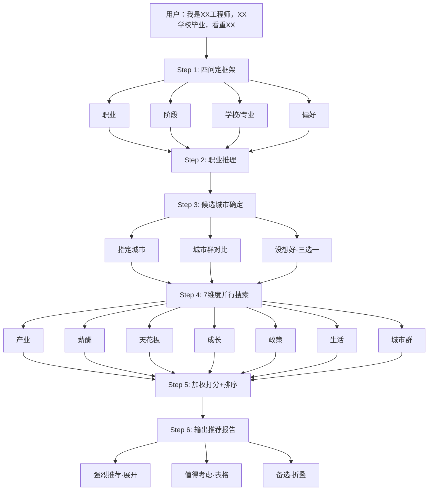

# 城市选择（City Advisor）— Claude Code Skill

> **输入职业和偏好，输出最适合发展的城市排序。**
>
> 不做主观建议，做多维度信息聚合——帮你发现适合你但你可能没想到的城市。

---

## 工作流



---

## 与 company-screener / company-research 的关系

```
city-advisor (城市选择层)     →  "我该去哪个城市？"
        ↓ 人工接力
company-screener (发现层)      →  "这个城市有什么好公司？"
        ↓ 人工接力
company-research (评估层)      →  "这家公司值不值得去？"
        ↓
你决策                       →  投简历/面试/接offer
```

三个 skill 独立运行。city-advisor 零文件依赖另外两个 skill。

---

## 功能特性

- **四问定框架**：职业 + 人生阶段 + 学校/专业 + 偏好维度
- **7维度评估**：产业匹配度、薪酬性价比、职业天花板、成长土壤、人才政策、生活适配、城市群生态
- **分阶段权重**：应届/成长期/定居三种权重矩阵，用户偏好可微调
- **国家级产业集群标签**：独立维护 career-industry-map.md，预设职业→工信部集群标签映射
- **学校因素融合**：学校层次×地域认可度 + 王牌专业→产业城市适配 + 校友网络密度
- **三种候选模式**：指定城市 / 城市群对比（长三角vs珠三角vs成渝vs京津冀vs中部）/ 没想好三选一
- **mcp-cnbs 集成**：国家统计局公开 API，27+ 工具直接查询经济数据
- **分层展示**：强烈推荐（≥7.5分）展开 + 值得考虑（5.5-7.4分）表格 + 备选（3.5-5.4分）折叠

---

## 安装

```bash
# 克隆项目
git clone <repo-url> company-analysis
cd company-analysis

# 安装依赖（项目本地，不影响系统环境）
npm install
```

项目根目录的 `.mcp.json` 自动配置 `mcp-cnbs` MCP 服务器，指向本地 `node_modules/`。无需全局安装。

## 使用

```
我该去哪个城市发展
帮我选城市
机械工程师应届去哪个城市好
哪个城市适合嵌入式开发
城市选择
城市推荐
我是电池工艺工程师，985毕业，3年经验，看重薪资和天花板，帮我推荐城市
```

---

## 文件结构

```
city-advisor/
├── SKILL.md                          ← 编排层
├── README.md
└── references/
    ├── career-industry-map.md        ← 职业→行业→城市产业评级映射
    ├── city-scoring-model.md         ← 7维打分模型 + 分阶段权重
    ├── data-sources.md               ← 数据源手册
    └── advisor-template.md           ← 输出模板
```

---

## 质量规则

1. 每条信号标注来源类型和年份
2. 薪资数据标注年份和来源平台
3. 人才政策标注年份（政策可能已调整）
4. 学校层次加分规则透明
5. 分值可追溯
6. 查不到就说查不到，不编造数据
7. 城市推荐不是命运判决——是信息聚合后的结构化讨论起点

## License

MIT
