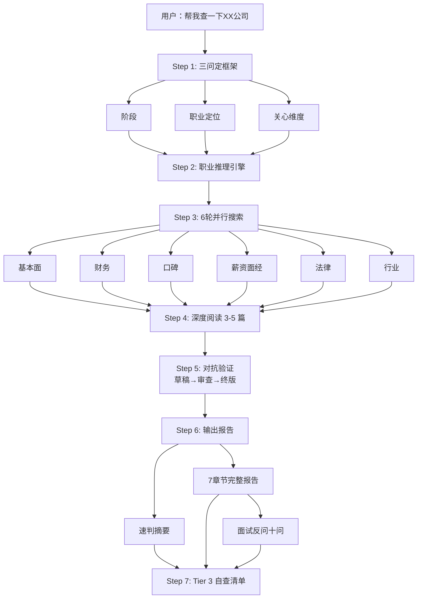

# 公司背调（Company Research）— Claude Code Skill

> **不输出百科，输出判断。**
>
> 输入一家公司，根据你的职业定位动态调整关注点，判断这家公司值不值得投。

---

## 工作流



---

## 示例输出

以下是用本 Skill 对**示例诊断设备公司**（机械工程师视角，海投筛选阶段）的背调结果：

### 速判摘要

> **一句话**：示例诊断生物子公司，做医学诊断仪器的真研发企业，机械岗是核心职能，但母公司连续三年亏损、员工口碑极差、行业寒冬中——海投阶段不建议优先投。
>
> **建议**：谨慎观望，除非没有更好选择且能接受低薪+不确定性。

### 完整报告包含

- 公司基本面（成立时间、规模、主营业务、资质）
- 财务与资本（近三年营收/净利润/资产趋势）
- 职业视角分析（岗位核心度、技术成长空间、薪资对标、面试反问）
- 员工口碑（来源标注可信度等级）
- 法律与合规风险（仲裁/诉讼/行政处罚）
- 行业与竞争（市场空间、公司位置、主要对手）
- 综合判断 + 最终建议 + 信息来源

---

## 功能特性

- **交互式三问定框架**：阶段 × 职业 × 关心维度，精准匹配你的需求
- **职业推理引擎**：3 维度动态分析任意职业，无需预设职业列表
- **三层数据源分级**：Tier 1 必查（公开）→ Tier 2 尽力（搜索引擎收录不确定）→ Tier 3 用户自查
- **6 轮并行搜索**：Exa + WebSearch 双源，覆盖基本面、财务、口碑、薪资、法律、行业
- **对抗验证**：报告输出前以反方视角检查，防止推断过度和信息遗漏
- **面试反问十问**：根据岗位生成低防御性面试反问，附带回答信号解读
- **结构化报告**：200 字速判摘要 + 7 章节完整报告
- **A vs B Offer 对比**：并排对比表 + 倾向性建议

---

## 安装

本模块是 career-advisor skill 的子模块，随插件一起安装，无需单独下载。

```bash
git clone <repo>
claude --plugin-dir .
```

## 依赖

| 工具 | 来源 | 必选 |
|------|------|:----:|
| WebSearch | Claude Code 内置 | 是 |
| WebFetch | Claude Code 内置 | 是 |
| Exa MCP | [ECC 插件](https://github.com/affaan-m/everything-claude-code) 内置 / 自行配置 | 推荐 |

如果没有 ECC 插件，可在 [exa.ai](https://exa.ai) 注册免费账号获取 API Key，然后在 `~/.claude.json` 添加 Exa MCP Server 配置。

## 使用

```
帮我查一下 [公司名]
[公司名] 怎么样
帮我背调 [公司名]
拿到 [公司名] 的 offer 了帮我看看
帮我对比 [公司A] 和 [公司B]
```

## 文件结构

```
company-research/
├── SKILL.md                      # 编排层（工作流程）
├── README.md
├── references/
│   ├── search-strategy.md        # 搜索执行手册（三层分级+6轮模板）
│   ├── career-inference.md       # 职业推理引擎（3维度动态分析）
│   ├── adversarial-review.md     # 对抗验证清单
│   ├── interview-questions.md    # 面试反问生成指南
│   └── report-template.md        # 报告模板（摘要+7章节+对比）
└── assets/
    └── tier3-user-checklist.md   # 用户自查清单
```

## 质量规则

1. 每条信息标注来源类型和可信度
2. 匿名评价标"仅供参考"，官方文件标"可信"
3. 查不到就说查不到，不编造
4. 区分事实和推断
5. 旧数据标年份，提醒可能已变化
6. 输出前执行对抗验证

## 反馈

欢迎在 [Issues](https://github.com/Friend-Xu/claude-skill-company-research/issues) 提交反馈或建议。

## License

MIT
