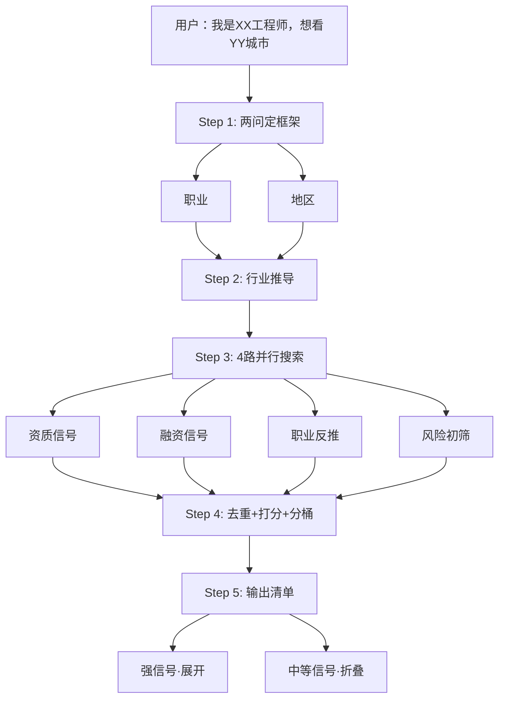

# 公司筛选（Company Screener）— Claude Code Skill

> **输入职业和城市，输出值得关注的公司清单。**
>
> 不做深度背调，做广度发现——帮你找到你不知道但值得看的公司。

---

## 工作流



---

## 与 company-research 的关系

```
company-screener (发现层)   →  "有什么公司值得看？"
        ↓ 人工接力
company-research (评估层)    →  "这家公司值不值得投？"
        ↓
你决策                    →  投/不投/面试追问
```

两个 skill 独立运行。

---

## 功能特性

- **只问两个事实**：职业 + 地区，不问行业偏好、不碰投资术语
- **职业→行业映射**：预设 15 个常见职业的行业枚举，自动推导对口赛道
- **4路并行搜索**：资质信号 + 融资信号 + 职业反推 + 风险初筛
- **职业反推**：不预设行业，从"公司在招这个岗位"反找公司
- **信号打分**：专精特新/融资轮次/投资方/产品关联度等 9 个维度加权评分
- **分层展示**：强信号默认展开 + 中等信号 `<details>` 折叠
- **行业分桶**：自动归类，一家公司可属于多个桶

---

## 安装

本模块是 career-advisor skill 的子模块，随插件一起安装，无需单独下载。

```bash
git clone <repo>
claude --plugin-dir .
```

## 使用

```
有哪些公司值得看
帮我筛选公司
机械工程师在苏州有哪些好公司
我是嵌入式开发，想看深圳的公司
公司筛选
找公司
```

---

## 文件结构

```
company-screener/
├── SKILL.md                          ← 编排层
├── README.md
└── references/
    ├── career-industry-map.md        ← 职业→行业映射表
    ├── screener-search-strategy.md   ← 搜索模板 + 打分规则
    └── screener-template.md          ← 输出模板
```

---

## 质量规则

1. 每条信号标注来源类型和年份
2. 融资数据标注年份（可能已变化）
3. 职业反推的招聘关联是弱信号，不代表职位仍在开放
4. 分值来自 checklist，可追溯
5. 查不到就说查不到，不编造公司

## License

MIT
